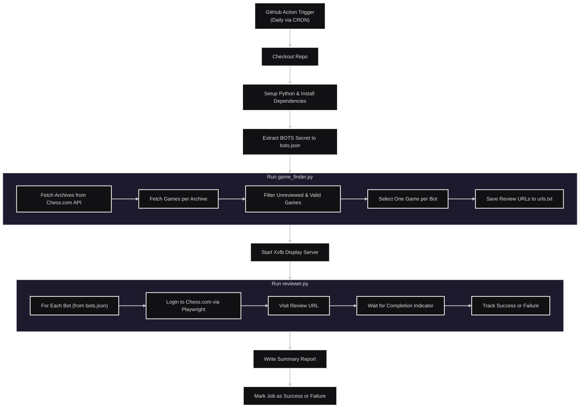

# ♟️ Chess ReviewerBots

**Chess ReviewerBots** is a GitHub Actions-powered automation project that reviews your latest chess games using bot accounts. Each bot analyzes one game per day. You control how many bots run by simply managing the JSON config in your GitHub Secrets—no code changes needed.

## 🚀 Features

- ⏰ **Daily Game Reviews** – Each bot reviews one recent game every day  
- ⚖️ **Auto-Scaling Bots** – The script automatically detects and runs all defined bots
- 🔐 **Secure by Design** – All sensitive data is safely stored in GitHub Secrets  
- ⚙️ **Runs on GitHub Actions** – No server or manual scheduling needed  
- 🐍 **Python-powered** – Easy to modify and extend

## 🛠 Tech Stack

- **Python** – Game review and login logic  
- **GitHub Actions** – Scheduler and automation platform  
- **GitHub Secrets** – Credential management and security

## 🔒 Security

This project uses **GitHub Secrets** to ensure all usernames and credentials are kept private:

- `PLAYER` – Your **main username** (the account whose games will be reviewed)
- `BOTS` – A **JSON object** storing the **usernames and passwords** for each bot

### 🔐 Example `BOTS` Secret Format

```json
{
  "bot1": {
    "user": "chess_user1",
    "pass": "password"
  },
  "bot2": {
    "user": "chess_user2",
    "pass": "password"
  },
  "bot3": {
    "user": "chess_user3",
    "pass": "password"
  }
}
```

> 🛡️ This entire object is stored as a **single secret** named `BOTS`.  
> 🔐 GitHub ensures that forked repositories **cannot access your secrets**, preventing unauthorized usage.

## 📦 Setup Instructions

1. **Fork this repository**
2. Go to your repo’s **Settings > Secrets and variables > Actions**
3. Click **New repository secret** and add:
   - `PLAYER` → your main username (as a string)
   - `BOTS` → the JSON object above with your actual bot credentials
4. ✅ That’s it! The Python script automatically detects and runs each bot—no need to modify workflows.

## 🔄 How It Works

- GitHub Actions runs once per day (schedule is configurable)
- It uses the `PLAYER` secret to find your most recent games
- Each bot in the `BOTS` secret logs in and reviews one game
- All bots are processed automatically—no manual scaling needed
- At the end, a summary will be provided showing which bots succeeded and which failed
- The Workflow succeeds if all bots were successful; if even one fails, the workflow will show as failed

## 📄 License

Licensed under the [MIT License](LICENSE.md).

## Flowchart


